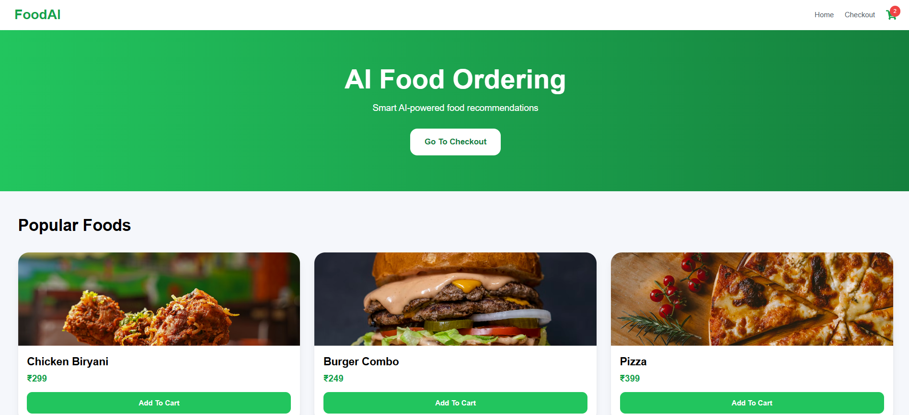
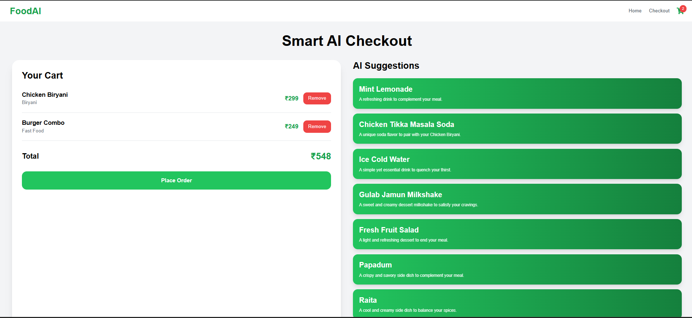
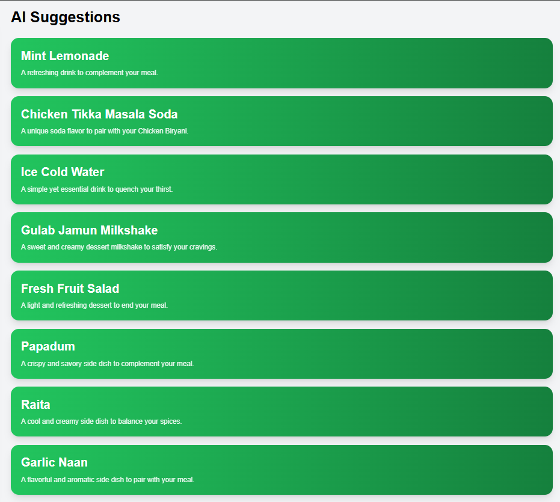
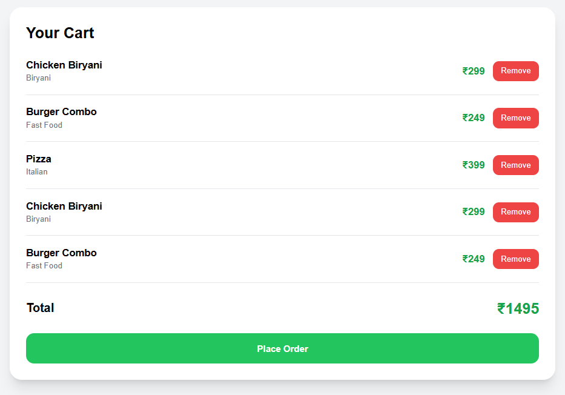

# 🍔 FoodAI — AI-Powered Smart Food Ordering System

FoodAI is a modern AI-powered food ordering and smart checkout application built using React, Tailwind CSS, Node.js, Express, and Groq AI.

The application allows users to:

- Browse food items
- Add/remove products from cart
- Get AI-powered food recommendations
- Experience a modern food delivery UI
- Simulate real-world smart checkout systems like Swiggy and Zomato

---

# 🚀 Features

## ✅ Frontend Features

- Modern responsive UI
- AI-powered smart checkout
- Dynamic food cards
- Add to cart functionality
- Remove from cart functionality
- Live cart count updates
- Responsive navbar
- Beautiful checkout interface
- LocalStorage cart persistence
- Real-time total calculation

---

## 🤖 AI Features

The system uses Groq AI to generate intelligent food recommendations based on user cart selections.

### Example

If user selects:

- Chicken Biryani
- Pizza

AI may suggest:

- Coke
- Garlic Bread
- Brownie
- French Fries

---

# 🛠️ Tech Stack

## Frontend

- React.js
- Vite
- Tailwind CSS
- React Router DOM
- Axios
- React Icons

## Backend

- Node.js
- Express.js
- Groq AI API
- dotenv
- CORS

---

# 📁 Project Structure

```bash
PROJECT_DESIGN
│
├── frontend
│   │
│   ├── src
│   │   ├── components
│   │   ├── pages
│   │   ├── data
│   │   ├── App.jsx
│   │   ├── main.jsx
│   │   └── index.css
│   │
│   ├── public
│   ├── package.json
│   └── vite.config.js
│
├── backend
│   │
│   ├── server.js
│   ├── package.json
│   └── .env
│
├── screenshots
│   ├── home-page.png
│   ├── checkout-page.png
│   ├── ai-suggestions.png
│   └── cart-system.png
│
├── README.md
└── .gitignore
```

---

# 📸 Screenshots

## 🏠 Home Page



---

## 🛒 Checkout Page



---

## 🤖 AI Suggestions



---

## 🧾 Cart System



---

# ⚙️ Installation & Setup

## 1️⃣ Clone Repository

```bash
git clone <your-github-repo-link>
```

---

## 2️⃣ Install Frontend Dependencies

```bash
cd frontend

npm install
```

Install required packages:

```bash
npm install axios react-router-dom react-icons
```

---

## 3️⃣ Install Backend Dependencies

```bash
cd ../backend

npm install
```

Install Groq SDK:

```bash
npm install groq-sdk
```

---

# 🔑 Environment Variables

Create:

```bash
backend/.env
```

Add:

```env
GROQ_API_KEY=your_groq_api_key
PORT=5000
```

---

# ▶️ Run Backend

Inside backend folder:

```bash
npm run dev
```

Backend runs on:

```bash
http://localhost:5000
```

---

# ▶️ Run Frontend

Inside frontend folder:

```bash
npm run dev
```

Frontend runs on:

```bash
http://localhost:5173
```

---

# 🧠 AI Workflow

```text
User Selects Food
        ↓
Cart Updates
        ↓
Frontend Sends Cart Data
        ↓
Backend API
        ↓
Groq AI Analysis
        ↓
AI Food Recommendations
        ↓
Suggestions Displayed
```

---

# 🎯 Core Functionalities

## ✅ Add To Cart

Users can dynamically add food items.

---

## ✅ Remove From Cart

Users can remove food items instantly.

---

## ✅ Live Cart Count

Navbar updates automatically when items are added or removed.

---

## ✅ Smart AI Recommendations

Recommendations change dynamically based on selected foods.

---

## ✅ LocalStorage Persistence

Cart data remains available after refresh.

---

# 🔮 Future Improvements

- User Authentication
- MongoDB Database
- Firebase Integration
- Payment Gateway Integration
- Voice AI Ordering
- Real-time Delivery Tracking
- Dark Mode
- AI Chatbot
- Admin Dashboard

---

# 👨‍💻 Author

Developed as part of an AI-Assisted Product Redesign project.

---

# ⭐ Project Goal

The goal of this project is to redesign a traditional food ordering checkout experience using AI-assisted workflows and smart recommendation systems.

---

# 💡 AI Usage Breakdown

AI tools were used during:

- UI brainstorming
- Smart checkout redesign
- AI recommendation workflow
- Component generation
- Backend AI integration
- README documentation
- UX improvement suggestions

The project demonstrates how AI can enhance user experience in modern food ordering platforms.
